<p align="center">
  
</p>

<h1 align="center">🚀 PRODIX</h1>

<p align="center">
  <strong>Social Gaming Companion + Android Performance Enhancer</strong>
  <br/>
  <em>Projet de Fin d'Études — 2025/2026</em>
</p>

<p align="center">
  <a href="https://github.com/StailiSaad/PRODIX/releases"></a>
  <a href="https://flutter.dev"></a>
  <a href="https://kotlinlang.org"></a>
  <a href="https://supabase.com"></a>
  <a href="https://firebase.google.com"></a>
  <a href="https://webrtc.org"></a>
  <a href="https://huggingface.co"></a>
  <a href="https://dart.dev"></a>
  <a href="https://developer.android.com/jetpack/compose"></a>
</p>

---

## 📋 Table des Matières

1. [Présentation Générale](#-présentation-générale)
2. [Fonctionnalités](#-fonctionnalités)
3. [Captures d'Écran](#-captures-décran)
4. [Architecture Technique](#-architecture-technique)
5. [Schéma de la Base de Données](#-schéma-de-la-base-de-données)
6. [Stack Technologique](#-stack-technologique)
7. [Installation](#-installation)
8. [Construction depuis les Sources](#-construction-depuis-les-sources)
9. [Modules Android Enhancer](#-modules-android-enhancer)
10. [Système de Communication](#-système-de-communication)
11. [Gamification & XP](#-gamification--xp)
12. [Sécurité & Permissions](#-sécurité--permissions)
13. [Licence](#-licence)

---

## 🎯 Présentation Générale

**Prodix** est une application mobile de **compagnon de jeu social** qui combine :

| Pilier | Description |
|--------|-------------|
| 🤝 **Social Matchmaking** | Trouvez des coéquipiers par jeu, région, disponibilité et niveau |
| 💬 **Communication Temps Réel** | Chat textuel, appels vocaux et vidéo via WebRTC |
| 🤖 **IA Modératrice** | Détection de toxicité et recommandations via Hugging Face |
| ⚡ **Performance Enhancer** | Optimisation système Android (root/ADB/Shizuku) |

Développée avec **Flutter 3.41** pour le frontend cross-platform et **Kotlin** pour le module natif Android, l'application s'appuie sur **Supabase** pour le backend (authentification, base de données temps réel, stockage) et **Firebase Cloud Messaging** pour les notifications push.

---

## ✨ Fonctionnalités

### 🌐 Plateforme Sociale

| Fonctionnalité | Description Détaillée |
|----------------|----------------------|
| **🔐 Authentification** | Inscription/Connexion via Supabase Auth avec gestion de session |
| **👤 Profils Utilisateurs** | Avatar, pseudo, jeux favoris, réseaux sociaux, XP, niveau |
| **🎮 Matchmaking Intelligent** | Algorithme de scoring basé sur jeu, région, disponibilité, rôle, niveau |
| **💬 Messagerie Temps Réel** | Messages directs et par canal avec médias (images, audio, vidéo) |
| **📞 Appels Audio/Vidéo** | Appels P2P, d'équipe et d'escouade via WebRTC avec ICE |
| **🏆 Équipes & Escouades** | Création d'équipes avec canaux de discussion et appels |
| **📱 Fil d'Actualités** | Posts avec images, likes, commentaires et visibilité publique/amis |
| **⭐ Système de Réputation** | Évaluation des coéquipiers sur skill, communication et conduite |
| **🎯 Quêtes & Progression** | Système de gamification avec XP, badges et niveaux |
| **🔔 Notifications Push** | Alertes pour messages, appels, invitations, likes via FCM |

### ⚡ Android Enhancer

| Module | Effet |
|--------|-------|
| **Frame Pacing** | Lissage du rafraîchissement et des phases SurfaceFlinger |
| **GoodPing** | Optimisation DNS, buffers TCP et connectivité réseau |
| **PerfExt** | Accélération GPU, mode performance et animations |
| **Runtime Control** | Désactivation doze, app standby et throttling thermique |
| **GamePulse** | Overlay mode jeu et optimisation pilote GPU |
| **GPU Boost** | Rendu Skia/Vulkan et composition matérielle améliorés |
| **Audio Tuning** | Optimisation audio flinger basse latence |
| **Hyper Performance** | Tuning complet CPU/GPU/mémoire/E/S |

### Modes de Performance

- **AUTO** — Ajustement dynamique selon l'utilisation
- **POWERSAVER** — Économie d'énergie maximale
- **BALANCED** — Compromis performance/autonomie
- **PERFORMANCE** — Haute performance soutenue
- **GAMING** — Performance maximale pour le jeu

### Modes d'Exécution

- **Root** — Exécution native via LibSu (auto-détection)
- **ADB** — `WRITE_SECURE_SETTINGS` grant via ADB
- **Shizuku** — Exécution via API Shizuku v13

---

## 📸 Captures d'Écran

### 🏠 Interface Principale

<table>
  <tr>
    <td align="center"><br/><em>Écran d'Accueil</em></td>
    <td align="center"><br/><em>Matchmaking</em></td>
    <td align="center"><br/><em>Mode Sombre</em></td>
    <td align="center"><br/><em>Mode Clair</em></td>
  </tr>
</table>

### 👤 Profil Utilisateur

<table>
  <tr>
    <td align="center"><br/><em>Profil — Vue Principale</em></td>
    <td align="center"><br/><em>Profil — Statistiques</em></td>
    <td align="center"><br/><em>Profil — Amis</em></td>
    <td align="center"><br/><em>Profil — Paramètres</em></td>
  </tr>
</table>

### 💬 Communication & Notifications

<table>
  <tr>
    <td align="center"><br/><em>Chat d'Équipe</em></td>
    <td align="center"><br/><em>Notification Barre</em></td>
    <td align="center"><br/><em>Notification In-App</em></td>
    <td align="center"><br/><em>Vue d'Ensemble</em></td>
  </tr>
</table>

### 🔄 Fil d'Actualités

<table>
  <tr>
    <td align="center">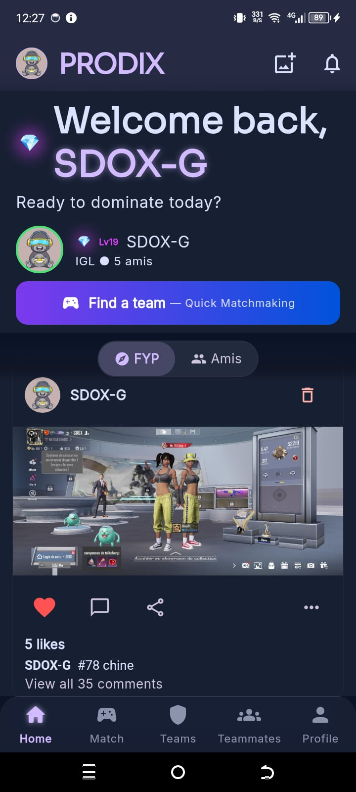<br/><em>Fil Public</em></td>
    <td align="center">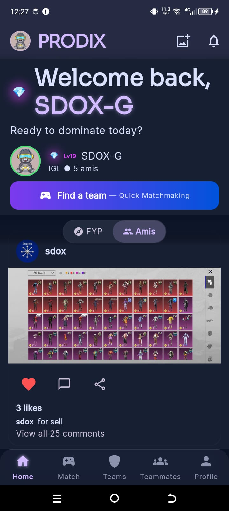<br/><em>Fil Amis</em></td>
  </tr>
</table>

### ⚡ Android Performance Enhancer

<table>
  <tr>
    <td align="center"><br/><em>Enhancer — Éteint</em></td>
    <td align="center">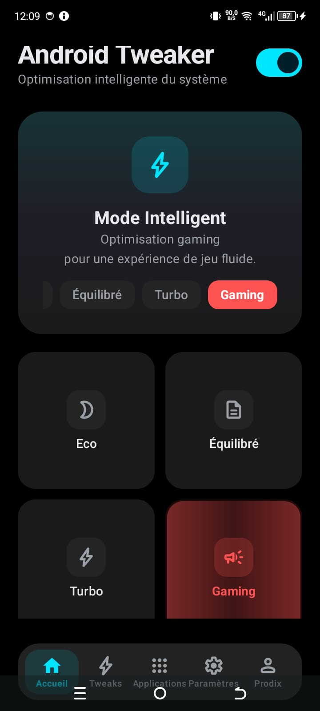<br/><em>Enhancer — Mode Gaming</em></td>
    <td align="center">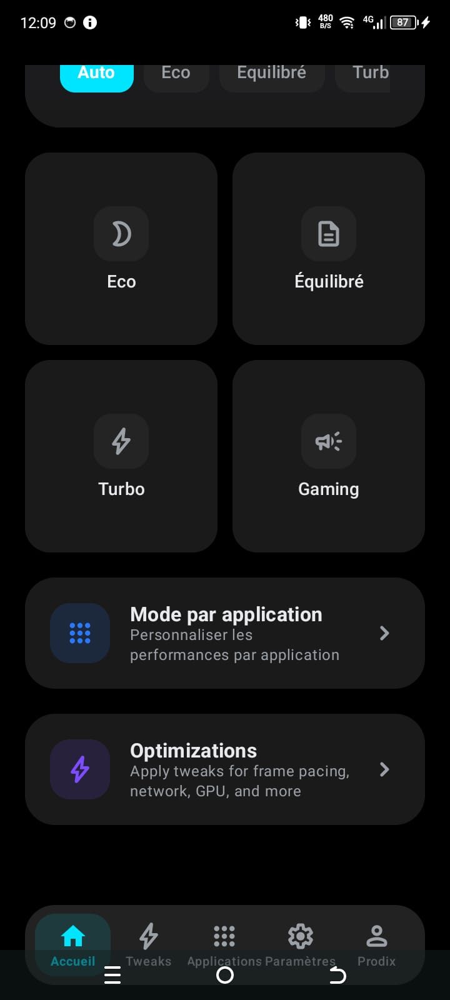<br/><em>Enhancer — Éteint (2)</em></td>
    <td align="center">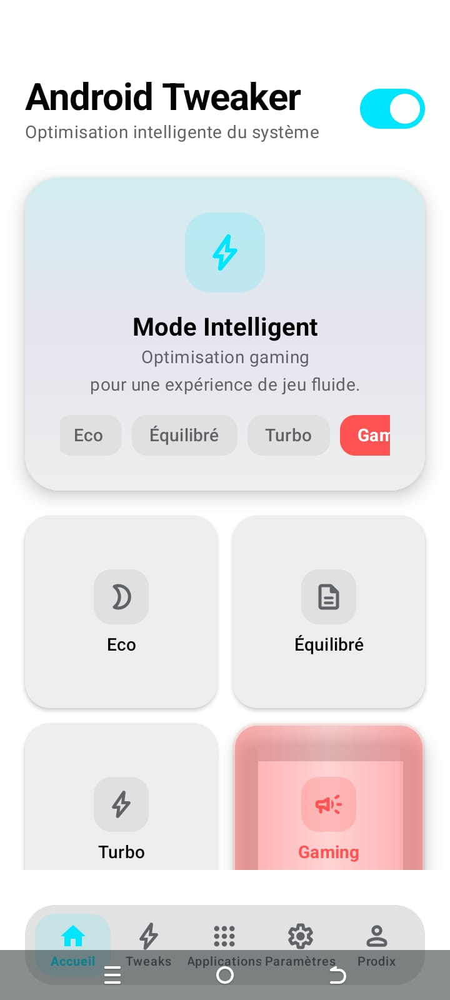<br/><em>Enhancer — Mode Clair</em></td>
  </tr>
</table>

### 🎛️ Modules d'Optimisation

<table>
  <tr>
    <td align="center">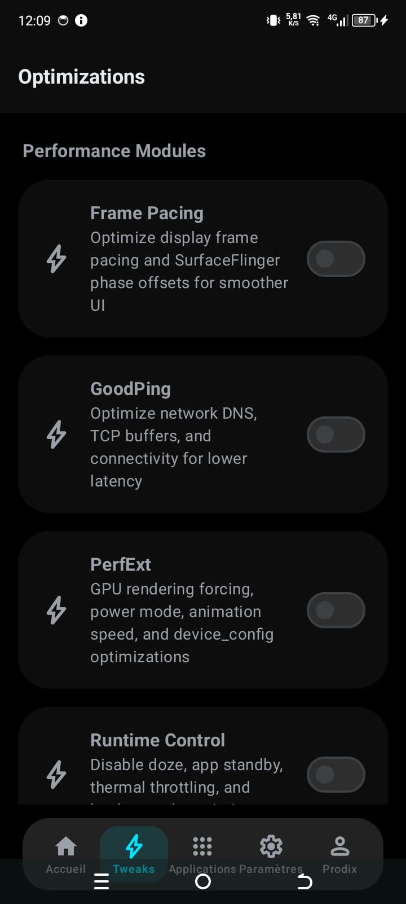<br/><em>Optimisation — Éteint (1)</em></td>
    <td align="center">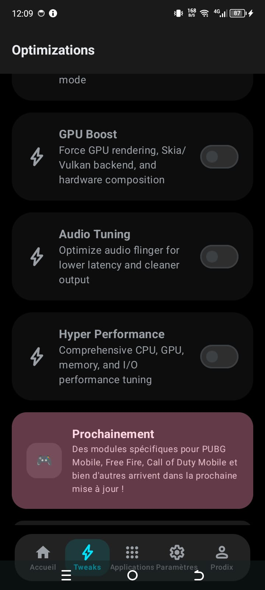<br/><em>Optimisation — Éteint (2)</em></td>
    <td align="center">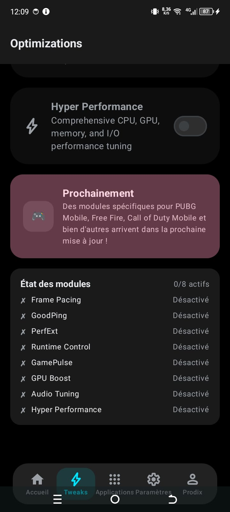<br/><em>Optimisation — État Modules</em></td>
    <td align="center">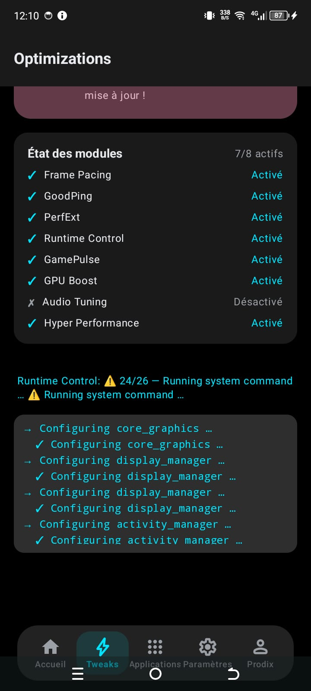<br/><em>Optimisation — Actif</em></td>
  </tr>
</table>

### 📱 Mode par Application

<table>
  <tr>
    <td align="center">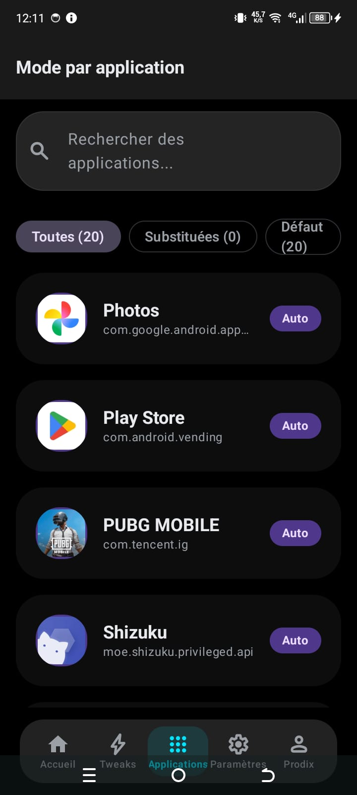<br/><em>Mode par App — Liste</em></td>
    <td align="center">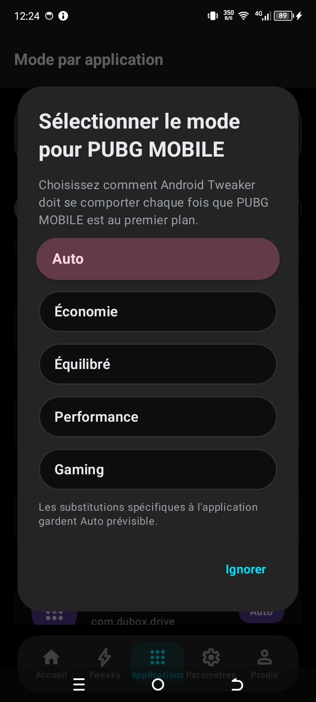<br/><em>Mode par App — Selection</em></td>
  </tr>
</table>

### ⚙️ Paramètres & Permissions

<table>
  <tr>
    <td align="center">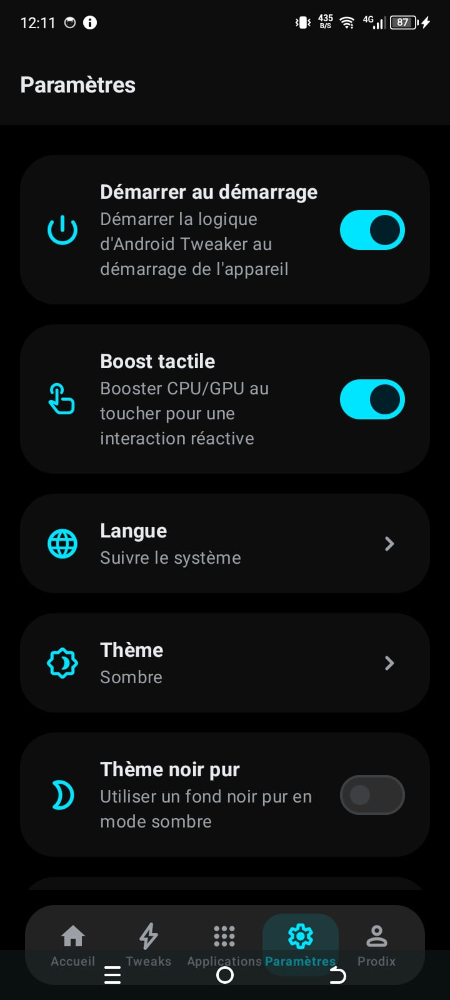<br/><em>Paramètres — Sombre</em></td>
    <td align="center">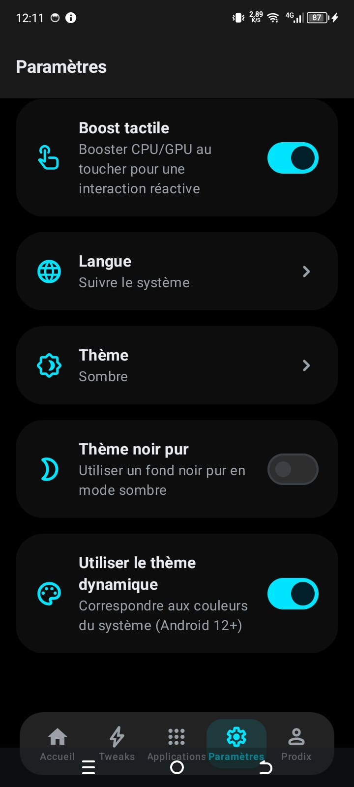<br/><em>Paramètres — Sombre (2)</em></td>
    <td align="center">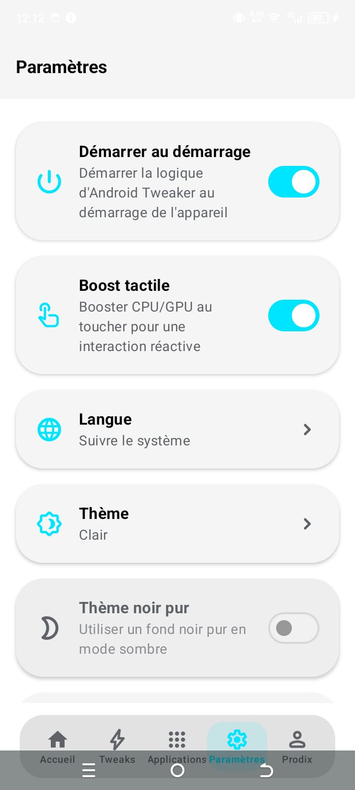<br/><em>Paramètres — Clair</em></td>
    <td align="center">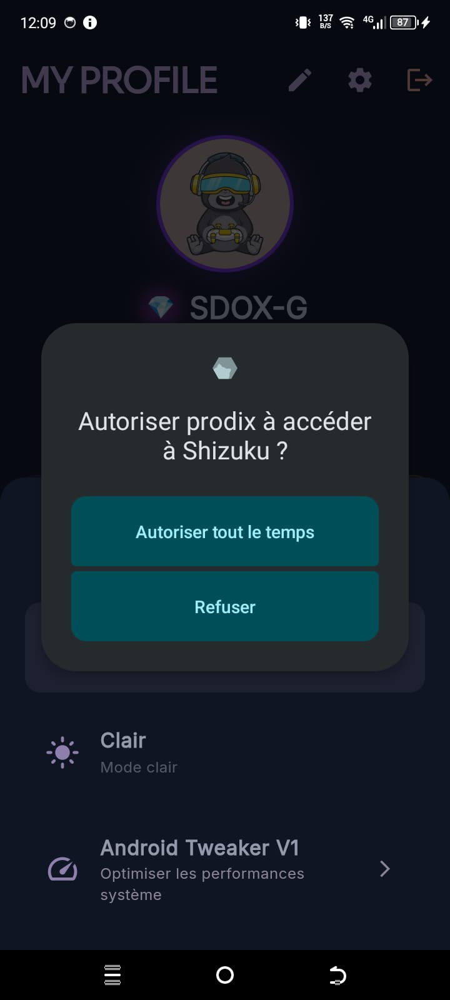<br/><em>Shizuku — Permission</em></td>
  </tr>
</table>

### 🔓 Accès Root

<table>
  <tr>
    <td align="center">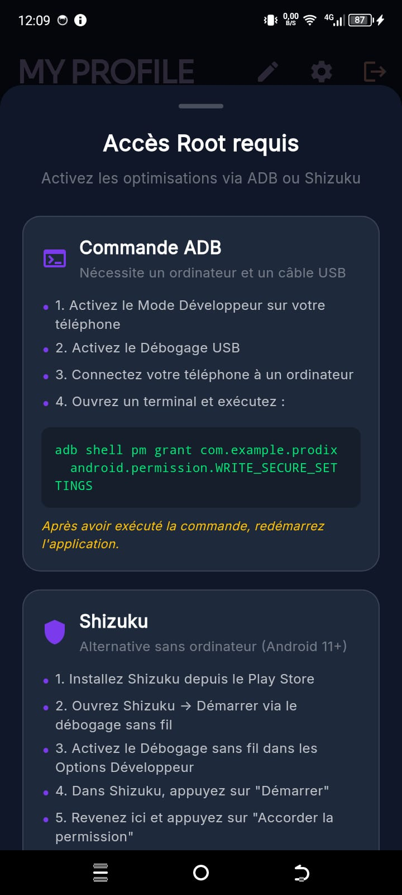<br/><em>Accès Root — Étape 1</em></td>
    <td align="center">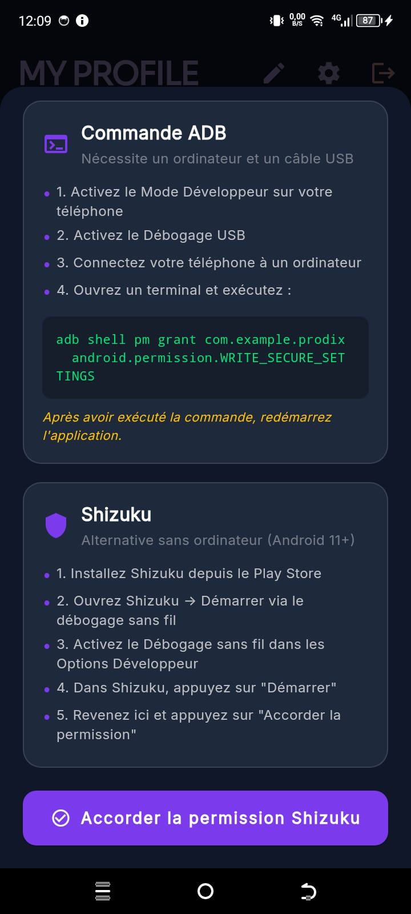<br/><em>Accès Root — Étape 2</em></td>
  </tr>
</table>

---

## 🏗️ Architecture Technique

### Architecture Globale

```
┌─────────────────────────────────────────────────────────────────────┐
│                        PRODIX                                       │
├──────────────────────────┬──────────────────────────────────────────┤
│   Flutter (Dart 3.11)    │     Android Native (Kotlin 2.0)         │
│                          │                                          │
│  ┌────────────────────┐  │  ┌──────────────────────────────────┐   │
│  │  UI Layer          │  │  │  Android Enhancer Module         │   │
│  │  ┌──────────────┐  │  │  │  ┌────────────────────────────┐ │   │
│  │  │ Screens      │  │  │  │  │ UI (Compose)               │ │   │
│  │  │ Widgets      │  │  │  │  │  ├─ HomeScreen             │ │   │
│  │  │ Themes       │  │  │  │  │  ├─ OptimizationScreen     │ │   │
│  │  └──────────────┘  │  │  │  │  ├─ PerAppModeScreen       │ │   │
│  │                    │  │  │  │  ├─ SettingsScreen         │ │   │
│  │  ┌──────────────┐  │  │  │  │  └─ AboutScreen           │ │   │
│  │  │ State Mgmt   │  │  │  │  ├────────────────────────────┤ │   │
│  │  │ Blocs/Cubits │  │  │  │  │ System Layer               │ │   │
│  │  └──────────────┘  │  │  │  │  ├─ OptimizationExecutor   │ │   │
│  │                    │  │  │  │  ├─ JniBridge              │ │   │
│  │  ┌──────────────┐  │  │  │  │  ├─ RootIpc / RootService  │ │   │
│  │  │ Services     │  │  │  │  │  ├─ ShizukuManager         │ │   │
│  │  │ ┌──────────┐ │  │  │  │  │  ├─ AccessibilityService   │ │   │
│  │  │ │ Supabase │ │  │  │  │  │  └─ BootService            │ │   │
│  │  │ │ AI       │ │  │  │  │  ├────────────────────────────┤ │   │
│  │  │ │ Progress │ │  │  │  │  │ Data Layer                 │ │   │
│  │  │ │ Games    │ │  │  │  │  │  ├─ AppRepository           │ │   │
│  │  │ └──────────┘ │  │  │  │  │  └─ AppPreferences(DataStore)│ │   │
│  │  └──────────────┘  │  │  │  └────────────────────────────┘ │   │
│  │                    │  │  └──────────────────────────────────┘   │
│  │  ┌──────────────┐  │                    ▲                       │
│  │  │ Data Layer   │  │                    │ MethodChannel         │
│  │  │ ┌──────────┐ │  │  ┌──────────────────────────────────┐   │
│  │  │ │ Models   │ │  │  │  MainActivity.kt                 │   │
│  │  │ │ Services │ │  │  │  EnhancerBridge singleton        │   │
│  │  │ │ Domain   │ │  │  └──────────────────────────────────┘   │
│  │  │ └──────────┘ │  │                                          │
│  │  └──────────────┘  │                                          │
│  └────────────────────┘  └──────────────────────────────────────────┘
│                          │
│  ┌──────────────────────────────────────────────────────────────┐  │
│  │  Backend (Supabase)                                          │  │
│  │  ┌───────────┐ ┌──────────┐ ┌──────────┐ ┌───────────────┐  │  │
│  │  │ PostgreSQL│ │ Realtime │ │ Storage  │ │ Auth           │  │  │
│  │  │ (RLS)     │ │ (WS)     │ │ Avatars  │ │ (JWT)          │  │  │
│  │  └───────────┘ └──────────┘ └──────────┘ └───────────────┘  │  │
│  └──────────────────────────────────────────────────────────────┘  │
│                          │                                          │
│  ┌──────────────────────────────────────────────────────────────┐  │
│  │  Services Externes                                            │  │
│  │  ┌──────────────┐ ┌──────────────────┐ ┌─────────────────┐  │  │
│  │  │ Hugging Face │ │ Firebase Cloud   │ │ WebRTC STUN/TURN│  │  │
│  │  │ Inference API│ │ Messaging (FCM)  │ │ Google Services │  │  │
│  │  └──────────────┘ └──────────────────┘ └─────────────────┘  │  │
│  └──────────────────────────────────────────────────────────────┘  │
└─────────────────────────────────────────────────────────────────────┘
```

### Architecture Flutter

```
lib/
├── main.dart                          # Point d'entrée
├── app_root.dart                      # Bootstrap, providers, routing
├── firebase_options.dart              # Configuration Firebase
├── core/
│   ├── config/
│   │   ├── app_config.dart            # Config variables d'environnement
│   │   └── profile_defaults.dart      # Valeurs par défaut profil
│   ├── services/
│   │   ├── non_root_service.dart      # Service Shizuku/ADB
│   │   ├── foreground_call_service.dart
│   │   ├── push_notification_service.dart
│   │   └── supabase_backend_service.dart  # Facade principale
│   └── theme/
│       └── app_theme.dart             # Thèmes Material 3
├── data/
│   └── services/
│       ├── domain/
│       │   ├── profile_service.dart
│       │   ├── chat_service.dart
│       │   ├── social_service.dart
│       │   ├── post_service.dart
│       │   ├── call_service.dart
│       │   ├── matching_service.dart
│       │   └── app_notification_service.dart
│       ├── ai_gateway_service.dart
│       ├── games_service.dart
│       └── supabase_progress_repository.dart
├── features/
│   ├── auth/                         # Login, Splash, Auth Cubit
│   ├── call/                         # Appels P2P, équipe, escouade
│   ├── dashboard/                    # MainScreen, DMs
│   ├── gamification/                 # Quêtes, XP
│   ├── posts/                        # Fil d'actualités
│   ├── profile/                      # Profil, configuration
│   └── theme/                        # Changement de thème
└── shared/
    └── widgets/                      # Widgets réutilisables
```

### Architecture Android Enhancer

```
android/androidenhancer/
└── src/main/java/com/androidtweaker/com/
    ├── MainActivity.kt               # Point d'entrée Hilt
    ├── di/AppModule.kt               # Injection de dépendances
    ├── data/
    │   ├── local/AppPreferences.kt   # DataStore preferences
    │   └── repository/AppRepository.kt # Repository central
    ├── system/
    │   ├── jni/
    │   │   ├── JniBridge.kt          # Pont natif C++
    │   │   └── AndroidEnhancerMode.kt # Enum des modes
    │   ├── optimization/
    │   │   └── OptimizationExecutor.kt # Exécution scripts shell
    │   ├── root/
    │   │   ├── RootIpc.kt            # Service root AIDL
    │   │   └── RootService.kt        # Implémentation root
    │   ├── service/
    │   │   ├── AccessibilityService.kt # Détection app foreground
    │   │   └── BootService.kt        # Service démarrage
    │   ├── receiver/BootReceiver.kt   # BOOT_COMPLETED
    │   └── util/
    │       ├── BatteryUtil.kt        # Capacité batterie
    │       ├── Constants.kt          # Constantes
    │       └── AppUtil.kt            # Liste apps installées
    └── ui/
        ├── navigation/
        │   ├── AppNavHost.kt         # Navigation Compose
        │   └── AppDestination.kt     # Destinations
        ├── theme/                    # Theme, Couleurs, Formes
        ├── components/               # Composants UI
        └── screens/
            ├── home/                 # HomeScreen, ViewModel, State
            ├── optimization/         # OptimizationScreen, ViewModel, State
            ├── per_app_mode/        # PerAppModeScreen, ViewModel, State
            ├── settings/             # SettingsScreen, ViewModel, State
            └── about/               # AboutScreen, ViewModel, State
```

### Data Flow

```
┌──────────┐    ┌──────────┐    ┌───────────────┐    ┌──────────┐
│  User    │───▶│  Bloc /  │───▶│   Service     │───▶│ Supabase │
│  Action  │    │  Cubit   │    │   Layer       │    │  Backend │
└──────────┘    └──────────┘    └───────┬───────┘    └──────────┘
                                        │
                                        ├──▶ AI Gateway ──▶ Hugging Face
                                        │
                                        └──▶ MethodChannel ──▶ Android Enhancer
                                                                   │
                                            ┌──────────────────────┤
                                            │         │            │
                                            ▼         ▼            ▼
                                        Root Ipc  Shizuku      ADB Shell
                                        (LibSu)   (v13 API)    (ProcessBuilder)
```

---

## 🗄️ Schéma de la Base de Données

### Tables Principales (Supabase PostgreSQL)

```
┌──────────────────────────────────────────────────────────────────┐
│                         PROFILES                                  │
├──────────────────────────────────────────────────────────────────┤
│ id          UUID PRIMARY KEY DEFAULT uuid_generate_v4()         │
│ username    TEXT UNIQUE NOT NULL                                 │
│ pseudo      TEXT                                                 │
│ avatar_url  TEXT                                                 │
│ bio         TEXT                                                 │
│ country     TEXT                                                 │
│ language    TEXT DEFAULT 'fr'                                    │
│ rank_mmr    INTEGER DEFAULT 1000                                 │
│ xp          INTEGER DEFAULT 0                                    │
│ level       INTEGER DEFAULT 1                                    │
│ game_type   TEXT DEFAULT 'FPS'                                   │
│ role        TEXT DEFAULT 'support'                               │
│ region      TEXT DEFAULT 'EU'                                    │
│ availability TEXT DEFAULT 'evening'                              │
│ birth_date  DATE                                                 │
│ social_instagram TEXT                                            │
│ social_facebook  TEXT                                            │
│ social_github   TEXT                                             │
│ created_at  TIMESTAMPTZ DEFAULT now()                            │
│ updated_at  TIMESTAMPTZ DEFAULT now()                            │
└──────────────────────────────────────────────────────────────────┘

┌──────────────────────────────────────────────────────────────────┐
│                         GAMES                                    │
├──────────────────────────────────────────────────────────────────┤
│ id          BIGINT PRIMARY KEY                                   │
│ name        TEXT NOT NULL                                        │
│ slug        TEXT                                                 │
│ genre       TEXT[]                                                │
│ platforms   TEXT[]                                                │
│ cover_url   TEXT                                                 │
│ summary     TEXT                                                 │
│ rating      REAL                                                 │
│ created_at  TIMESTAMPTZ DEFAULT now()                            │
└──────────────────────────────────────────────────────────────────┘

┌──────────────────────────────────────────────────────────────────┐
│                    PROFILE_FAVORITE_GAMES                        │
├──────────────────────────────────────────────────────────────────┤
│ profile_id  UUID REFERENCES profiles(id) ON DELETE CASCADE      │
│ game_id     BIGINT REFERENCES games(id) ON DELETE CASCADE       │
│ created_at  TIMESTAMPTZ DEFAULT now()                            │
│ PRIMARY KEY (profile_id, game_id)                                │
└──────────────────────────────────────────────────────────────────┘

┌──────────────────────────────────────────────────────────────────┐
│                         TEAMS                                    │
├──────────────────────────────────────────────────────────────────┤
│ id          UUID PRIMARY KEY                                     │
│ name        TEXT NOT NULL                                        │
│ description TEXT                                                 │
│ avatar_url  TEXT                                                 │
│ created_by  UUID REFERENCES profiles(id)                         │
│ max_members INTEGER DEFAULT 50                                   │
│ squad_id    UUID REFERENCES squads(id)                           │
│ created_at  TIMESTAMPTZ DEFAULT now()                            │
└──────────────────────────────────────────────────────────────────┘

┌──────────────────────────────────────────────────────────────────┐
│                      TEAM_MEMBERS                                │
├──────────────────────────────────────────────────────────────────┤
│ team_id     UUID REFERENCES teams(id) ON DELETE CASCADE         │
│ profile_id  UUID REFERENCES profiles(id) ON DELETE CASCADE      │
│ role        TEXT DEFAULT 'member'                                │
│ joined_at   TIMESTAMPTZ DEFAULT now()                            │
│ PRIMARY KEY (team_id, profile_id)                                │
└──────────────────────────────────────────────────────────────────┘

┌──────────────────────────────────────────────────────────────────┐
│                         SQUADS                                   │
├──────────────────────────────────────────────────────────────────┤
│ id          UUID PRIMARY KEY                                     │
│ name        TEXT NOT NULL                                        │
│ description TEXT                                                 │
│ created_by  UUID REFERENCES profiles(id)                         │
│ max_members INTEGER DEFAULT 5                                    │
│ created_at  TIMESTAMPTZ DEFAULT now()                            │
└──────────────────────────────────────────────────────────────────┘

┌──────────────────────────────────────────────────────────────────┐
│                      SQUAD_MEMBERS                               │
├──────────────────────────────────────────────────────────────────┤
│ squad_id    UUID REFERENCES squads(id) ON DELETE CASCADE        │
│ profile_id  UUID REFERENCES profiles(id) ON DELETE CASCADE      │
│ role        TEXT DEFAULT 'member'                                │
│ joined_at   TIMESTAMPTZ DEFAULT now()                            │
│ PRIMARY KEY (squad_id, profile_id)                               │
└──────────────────────────────────────────────────────────────────┘

┌──────────────────────────────────────────────────────────────────┐
│                       CHANNELS                                   │
├──────────────────────────────────────────────────────────────────┤
│ id          UUID PRIMARY KEY                                     │
│ team_id     UUID REFERENCES teams(id) ON DELETE CASCADE         │
│ name        TEXT NOT NULL                                        │
│ type        TEXT DEFAULT 'text'                                  │
│ created_at  TIMESTAMPTZ DEFAULT now()                            │
└──────────────────────────────────────────────────────────────────┘

┌──────────────────────────────────────────────────────────────────┐
│                       MESSAGES                                   │
├──────────────────────────────────────────────────────────────────┤
│ id          BIGINT PRIMARY KEY GENERATED ALWAYS AS IDENTITY     │
│ channel_id  UUID REFERENCES channels(id) ON DELETE CASCADE      │
│ sender_id   UUID REFERENCES profiles(id) NOT NULL               │
│ receiver_id UUID REFERENCES profiles(id)                        │
│ content     TEXT                                                 │
│ media_url   TEXT                                                 │
│ media_type  TEXT                                                 │
│ media_name  TEXT                                                 │
│ duration    INTEGER                                              │
│ status      TEXT DEFAULT 'sent'                                  │
│ created_at  TIMESTAMPTZ DEFAULT now()                            │
│ (Realtime enabled)                                               │
└──────────────────────────────────────────────────────────────────┘

┌──────────────────────────────────────────────────────────────────┐
│                        CALLS (P2P)                               │
├──────────────────────────────────────────────────────────────────┤
│ id          UUID PRIMARY KEY                                     │
│ caller_id   UUID REFERENCES profiles(id) NOT NULL               │
│ callee_id   UUID REFERENCES profiles(id) NOT NULL               │
│ status      TEXT DEFAULT 'ringing'                               │
│ call_type   TEXT DEFAULT 'audio'                                 │
│ offer_sdp   TEXT                                                 │
│ answer_sdp  TEXT                                                 │
│ created_at  TIMESTAMPTZ DEFAULT now()                            │
│ updated_at  TIMESTAMPTZ DEFAULT now()                            │
│ (Realtime enabled)                                               │
└──────────────────────────────────────────────────────────────────┘

┌──────────────────────────────────────────────────────────────────┐
│                   TEAM_CALLS                                     │
├──────────────────────────────────────────────────────────────────┤
│ id          UUID PRIMARY KEY                                     │
│ team_id     UUID REFERENCES teams(id) ON DELETE CASCADE         │
│ caller_id   UUID REFERENCES profiles(id) NOT NULL               │
│ status      TEXT DEFAULT 'ringing'                               │
│ call_type   TEXT DEFAULT 'audio'                                 │
│ offer_sdp   TEXT                                                 │
│ created_at  TIMESTAMPTZ DEFAULT now()                            │
│ updated_at  TIMESTAMPTZ DEFAULT now()                            │
│ (Realtime enabled)                                               │
└──────────────────────────────────────────────────────────────────┘

┌──────────────────────────────────────────────────────────────────┐
│                TEAM_CALL_PARTICIPANTS                             │
├──────────────────────────────────────────────────────────────────┤
│ id          BIGINT PRIMARY KEY GENERATED ALWAYS AS IDENTITY     │
│ call_id     UUID REFERENCES team_calls(id) ON DELETE CASCADE    │
│ profile_id  UUID REFERENCES profiles(id) ON DELETE CASCADE      │
│ joined_at   TIMESTAMPTZ                                         │
│ left_at     TIMESTAMPTZ                                         │
│ (Realtime enabled)                                               │
└──────────────────────────────────────────────────────────────────┘

┌──────────────────────────────────────────────────────────────────┐
│                    CALL_ICE_CANDIDATES                            │
├──────────────────────────────────────────────────────────────────┤
│ id          BIGINT PRIMARY KEY GENERATED ALWAYS AS IDENTITY     │
│ call_id     UUID REFERENCES calls(id) ON DELETE CASCADE         │
│ profile_id  UUID REFERENCES profiles(id) ON DELETE CASCADE      │
│ candidate   TEXT NOT NULL                                        │
│ created_at  TIMESTAMPTZ DEFAULT now()                            │
│ (Realtime enabled)                                               │
└──────────────────────────────────────────────────────────────────┘

┌──────────────────────────────────────────────────────────────────┐
│                        POSTS                                     │
├──────────────────────────────────────────────────────────────────┤
│ id          UUID PRIMARY KEY                                     │
│ profile_id  UUID REFERENCES profiles(id) ON DELETE CASCADE      │
│ content     TEXT NOT NULL                                        │
│ media_url   TEXT                                                 │
│ visibility  TEXT DEFAULT 'public' (public/friends)               │
│ created_at  TIMESTAMPTZ DEFAULT now()                            │
│ updated_at  TIMESTAMPTZ DEFAULT now()                            │
│ (Realtime enabled)                                               │
└──────────────────────────────────────────────────────────────────┘

┌──────────────────────────────────────────────────────────────────┐
│                     POST_LIKES                                   │
├──────────────────────────────────────────────────────────────────┤
│ id          BIGINT PRIMARY KEY GENERATED ALWAYS AS IDENTITY     │
│ post_id     UUID REFERENCES posts(id) ON DELETE CASCADE         │
│ profile_id  UUID REFERENCES profiles(id) ON DELETE CASCADE      │
│ created_at  TIMESTAMPTZ DEFAULT now()                            │
│ UNIQUE (post_id, profile_id)                                     │
│ (Realtime enabled)                                               │
└──────────────────────────────────────────────────────────────────┘

┌──────────────────────────────────────────────────────────────────┐
│                    POST_COMMENTS                                 │
├──────────────────────────────────────────────────────────────────┤
│ id          BIGINT PRIMARY KEY GENERATED ALWAYS AS IDENTITY     │
│ post_id     UUID REFERENCES posts(id) ON DELETE CASCADE         │
│ profile_id  UUID REFERENCES profiles(id) ON DELETE CASCADE      │
│ content     TEXT NOT NULL                                        │
│ created_at  TIMESTAMPTZ DEFAULT now()                            │
│ (Realtime enabled)                                               │
└──────────────────────────────────────────────────────────────────┘
```

### Relations Clés

```
profiles ──1:N──▶ profile_favorite_games ──N:1──▶ games
profiles ──1:N──▶ teams (created_by)
teams ────1:N──▶ team_members ──N:1──▶ profiles
teams ────1:N──▶ channels ──1:N──▶ messages
squads ───1:N──▶ squad_members ──N:1──▶ profiles
profiles ──1:N──▶ calls (caller/callee)
teams ────1:N──▶ team_calls ──1:N──▶ team_call_participants
calls ────1:N──▶ call_ice_candidates
profiles ──1:N──▶ posts ──1:N──▶ post_likes
posts ────1:N──▶ post_comments
profiles ──1:N──▶ sent_invitations
profiles ──1:N──▶ received_invitations
profiles ──1:N──▶ friends
profiles ──1:N──▶ notifications
profiles ──1:N──▶ devices (FCM tokens)
profiles ──1:N──▶ reputation_reviews
profiles ──1:N──▶ user_progress (gamification)
```

### Politiques RLS (Row Level Security)

Toutes les tables disposent de politiques RLS. Exemples :

- **profiles**: SELECT pour tous les utilisateurs authentifiés, UPDATE pour le propriétaire
- **teams**: SELECT pour les membres, INSERT pour les utilisateurs authentifiés
- **messages**: SELECT/INSERT pour les membres du canal
- **calls**: SELECT/INSERT/UPDATE pour les participants
- **posts**: SELECT selon visibilité (public/amis), INSERT pour le propriétaire
- **notifications**: SELECT/UPDATE pour le destinataire uniquement

### Realtime Subscriptions

| Table | Type |
|-------|------|
| messages | Real-time (WebSocket) |
| calls | Real-time |
| team_calls | Real-time |
| team_call_participants | Real-time |
| squad_calls | Real-time |
| squad_call_participants | Real-time |
| call_ice_candidates | Real-time |
| posts | Real-time |
| post_likes | Real-time |
| post_comments | Real-time |
| notifications | Real-time |

---

## 🛠️ Stack Technologique

### Frontend (Flutter)

| Technologie | Version | Utilisation |
|-------------|---------|-------------|
| Flutter | 3.41 | Framework cross-platform |
| Dart | 3.11 | Langage de programmation |
| flutter_bloc | 8.1.6 | State management (BLoC/Cubit) |
| equatable | 2.0.7 | Value equality pour états |
| supabase_flutter | 2.8.0 | Client Supabase (Auth, DB, Realtime, Storage) |
| flutter_webrtc | 1.4.1 | WebRTC pour appels audio/vidéo |
| firebase_core | 3.12.0 | Initialisation Firebase |
| firebase_messaging | 15.2.0 | Notifications push FCM |
| get_it | 9.2.1 | Injection de dépendances |
| shared_preferences | 2.5.3 | Stockage local |
| image_picker | 1.2.0 | Sélection d'images |
| geolocator | 13.0.1 | Géolocalisation |
| google_fonts | 8.1.0 | Polices Google (Inter, Sora, Playfair) |
| http | 1.2.2 | Requêtes HTTP |
| intl | 0.20.1 | Internationalisation |
| audioplayers | 6.1.0 | Lecture audio |
| record | 6.2.1 | Enregistrement audio |
| permission_handler | 12.0.1 | Gestion des permissions |
| file_picker | 11.0.2 | Sélection de fichiers |
| share_plus | 10.1.4 | Partage |
| url_launcher | 6.3.2 | Ouverture de liens |
| workmanager | 0.9.0 | Tâches background |
| flutter_local_notifications | 18.0.1 | Notifications locales |
| quest_gamification | 0.1.0 | Système de quêtes |

### Android Native (Enhancer)

| Technologie | Version | Utilisation |
|-------------|---------|-------------|
| Kotlin | 2.0 | Langage natif Android |
| Jetpack Compose | BOM 2024.12 | UI native |
| Jetpack Navigation Compose | 2.8.5 | Navigation entre écrans |
| Dagger Hilt | 2.57 | Injection de dépendances |
| DataStore Preferences | 1.1.1 | Stockage local type-safe |
| Lifecycle ViewModel Compose | 2.8.7 | ViewModel + Compose |
| Material 3 | - | Design system natif |
| Shizuku API | 13.1.5 | Exécution shell non-root |
| Coroutines | 1.9.0 | Async natif |
| JUnit | 4.13.2 | Tests unitaires |
| Truth | 1.4.4 | Assertions tests |
| Mockk | 1.13.14 | Mocking tests |
| Turbine | 1.2.0 | Test Flow |

### Backend & Services

| Technologie | Utilisation |
|-------------|-------------|
| **Supabase** | Backend as a Service (PostgreSQL, Auth, Realtime, Storage) |
| **PostgreSQL** | Base de données relationnelle avec RLS |
| **Firebase Cloud Messaging** | Notifications push |
| **Hugging Face Inference API** | Détection de toxicité IA |
| **WebRTC** (Google STUN/TURN) | Communication temps réel |
| **Firebase Cloud Functions** (Deno) | Edge Functions pour push notifications |

---

## 📲 Installation

### Téléchargement Direct

Téléchargez le dernier APK depuis la page [GitHub Releases](https://github.com/StailiSaad/PRODIX/releases).

| Fichier | Taille | Prérequis |
|---------|--------|-----------|
| `prodix-v1.0.0.apk` | ~98 MB | Android 7.0+ (API 24), 2 GB RAM min. |

### Installation via ADB

```bash
# Installer l'APK
adb install prodix-v1.0.0.apk

# Accorder les permissions pour l'Android Enhancer (non-root)
adb shell pm grant com.example.prodix android.permission.WRITE_SECURE_SETTINGS
```

### Modes d'Exécution de l'Enhancer

| Mode | Méthode | Prérequis |
|------|---------|-----------|
| **Root** | LibSu | Appareil rooté (auto-détection) |
| **ADB** | ProcessBuilder + WRITE_SECURE_SETTINGS | Commande ADB exécutée une fois |
| **Shizuku** | Shizuku v13 API | Application Shizuku installée + autorisation |

> **Note**: Les utilisateurs root n'ont pas besoin de la commande ADB. L'application détecte automatiquement l'accès root.

---

## 🔧 Construction depuis les Sources

```bash
# 1. Cloner le dépôt
git clone https://github.com/StailiSaad/PRODIX.git
cd PRODIX

# 2. Installer les dépendances Flutter
flutter pub get

# 3. Configurer les variables d'environnement
#    (optionnel - les valeurs par défaut sont déjà configurées)
flutter build apk --release --dart-define=SUPABASE_URL=... --dart-define=SUPABASE_ANON_KEY=...

# 4. Build release APK
flutter build apk --release

# L'APK se trouve dans : build/app/outputs/flutter-apk/app-release.apk
```

---

## ⚡ Modules Android Enhancer (Détail)

### 1. Frame Pacing
Lisse le rafraîchissement de l'affichage en ajustant les décalages de phase SurfaceFlinger :
```
setprop debug.sf.showupdates 0
setprop debug.egl.hw 1
setprop debug.sf.hw 1
setprop debug.composition.type gpu
setprop video.accelerate.hw 1
service call SurfaceFlinger 1008 i32 1
settings put global window_animation_scale 0.5
settings put global transition_animation_scale 0.5
settings put global animator_duration_scale 0.5
```

### 2. GoodPing
Optimise la connectivité réseau et la latence DNS :
```
setprop net.dns1 8.8.8.8
setprop net.dns2 8.8.4.4
setprop net.tcp.buffers.default 4096,87380,256960,4096,16384,256960
setprop net.tcp.buffers.wifi 4096,87380,256960,4096,16384,256960
setprop net.tcp.buffers.lte 4096,87380,256960,4096,16384,256960
```

### 3. PerfExt
Améliore le rendu GPU et la vitesse des animations :
```
setprop debug.performance.tuning 1
setprop debug.gralloc.gfx_ubwc 1
setprop debug.renderengine.backend opengles
setprop persist.sys.composition.type gpu
setprop debug.sf.enable_hwc_vds 0
```

### 4. Runtime Control
Désactive les restrictions d'arrière-plan :
```
settings put global app_standby_enabled 0
settings put global doze_enabled 0
settings put global device_idle_constants 0
settings put global adaptive_battery_management_enabled 0
settings put global cached_apps_freezer enabled=0
```

### 5. GamePulse
Active le mode jeu et l'overlay GPU :
```
settings put global game_driver_opt_in 1
settings put global game_driver_all_apps 1
settings put global game_driver_blacklist ""
setprop debug.game.driver 1
```

### 6. GPU Boost
Optimise le rendu Skia/Vulkan et active la composition matérielle :
```
setprop debug.renderengine.backend skiavk
setprop debug.hwui.renderer skiavk
setprop debug.hwui.use_hw_vulkan 1
setprop debug.composition.type mdp
```

### 7. Audio Tuning
Optimise le pipeline audio pour la basse latence :
```
setprop persist.audio.fluence.voicecall true
setprop persist.audio.fluence.speaker true
setprop persist.audio.fluence.voicerec true
setprop persist.vendor.audio.voicecall.speaker.stereo true
```

### 8. Hyper Performance
Optimisation complète CPU/GPU/mémoire :
```
stop thermal-engine
stop thermald
stop thermorelay
echo performance > /sys/devices/system/cpu/cpu0/cpufreq/scaling_governor
echo 1 > /sys/devices/system/cpu/cpu0/online
echo 1 > /sys/devices/system/cpu/cpu1/online
# ... (optimisation complète CPU/GPU/mémoire/I/O)
```

---

## 📞 Système de Communication

### WebRTC Flow

```
┌──────────┐     ┌──────────┐     ┌──────────┐     ┌──────────┐
│ Caller   │     │ Supabase │     │ Callee   │     │ STUN/TURN│
│ Device   │     │ Realtime │     │ Device   │     │  Server  │
└────┬─────┘     └────┬─────┘     └────┬─────┘     └────┬─────┘
     │                │                │                │
     │── create_call ─▶                │                │
     │                │── notify ────▶ │                │
     │◀── call data ──┤                │                │
     │                │                │── join_call ──▶│
     │── offer SDP ──▶│                │                │
     │                │── offer SDP ──▶│                │
     │                │                │── answer SDP ─▶│
     │◀─ answer SDP ──┤◀─ answer SDP ──┤                │
     │                │                │                │
     │── ICE cand. ──▶│                │                │
     │◀─ ICE cand. ───┤◀─ ICE cand. ───┤                │
     │                │                │                │
     │═══════════════════════════════════════════════════════▶
     │              WebRTC P2P (SRTP/SCTP)                  │
     │◀═══════════════════════════════════════════════════════
     │                │                │                │
     │── update_call ─▶                │                │
     │                │── notify ────▶ │                │
```

### Types d'Appels

| Type | Participants | Cas d'Usage |
|------|-------------|-------------|
| **P2P Call** | 2 | Discussion privée |
| **Team Call** | Jusqu'à 50 | Communication d'équipe |
| **Squad Call** | Jusqu'à 5 | Communication d'escouade |

### ICE Candidates

Les candidats ICE sont échangés via Supabase Realtime pour établir la connexion P2P. Le serveur STUN/TURN Google est utilisé pour la résolution NAT.

---

## 🎮 Gamification & XP

### Système de Progression

```
user_progress
├── profile_id  UUID PRIMARY KEY
├── total_xp    INTEGER DEFAULT 0
├── level       INTEGER DEFAULT 1
├── badges      JSONB DEFAULT '[]'
├── quests      JSONB DEFAULT '{}'
├── created_at  TIMESTAMPTZ DEFAULT now()
└── updated_at  TIMESTAMPTZ DEFAULT now()
```

### Quêtes et Récompenses

Le système utilise le package `quest_gamification` avec :
- Quêtes quotidiennes, hebdomadaires et spéciales
- Badges débloquables
- XP et niveaux
- Suivi de progression

---

## 🔒 Sécurité & Permissions

### Permissions Android

| Permission | Usage |
|------------|-------|
| `INTERNET` | Communication réseau |
| `CAMERA` | Appels vidéo |
| `RECORD_AUDIO` | Appels audio/vidéo |
| `ACCESS_FINE_LOCATION` | Géolocalisation matchmaking |
| `READ_EXTERNAL_STORAGE` | Partage de médias |
| `WRITE_EXTERNAL_STORAGE` | Sauvegarde de médias |
| `POST_NOTIFICATIONS` | Notifications Android 13+ |
| `WRITE_SECURE_SETTINGS` | Optimisation système (ADB) |
| `BIND_ACCESSIBILITY_SERVICE` | Détection app foreground |
| `RECEIVE_BOOT_COMPLETED` | Redémarrage service boot |

### RLS Supabase

Toutes les tables sont protégées par Row Level Security :
- Lecture : accessible selon le contexte (public, friends, member)
- Écriture : restreinte au propriétaire ou aux membres autorisés
- Les politiques sont définies dans `supabase_setup.sql`

---

## 📄 Licence

Propriétaire. Tous droits réservés.

---

<p align="center">
  <strong>PRODIX</strong> — Projet de Fin d'Études 2025/2026
  <br/>
  Développé par <a href="https://github.com/StailiSaad">Staili Saad</a>
  <br/>
  <a href="https://github.com/StailiSaad/PRODIX">GitHub</a> &nbsp;|&nbsp;
  <a href="https://github.com/StailiSaad/PRODIX/releases">Releases</a>
</p>
