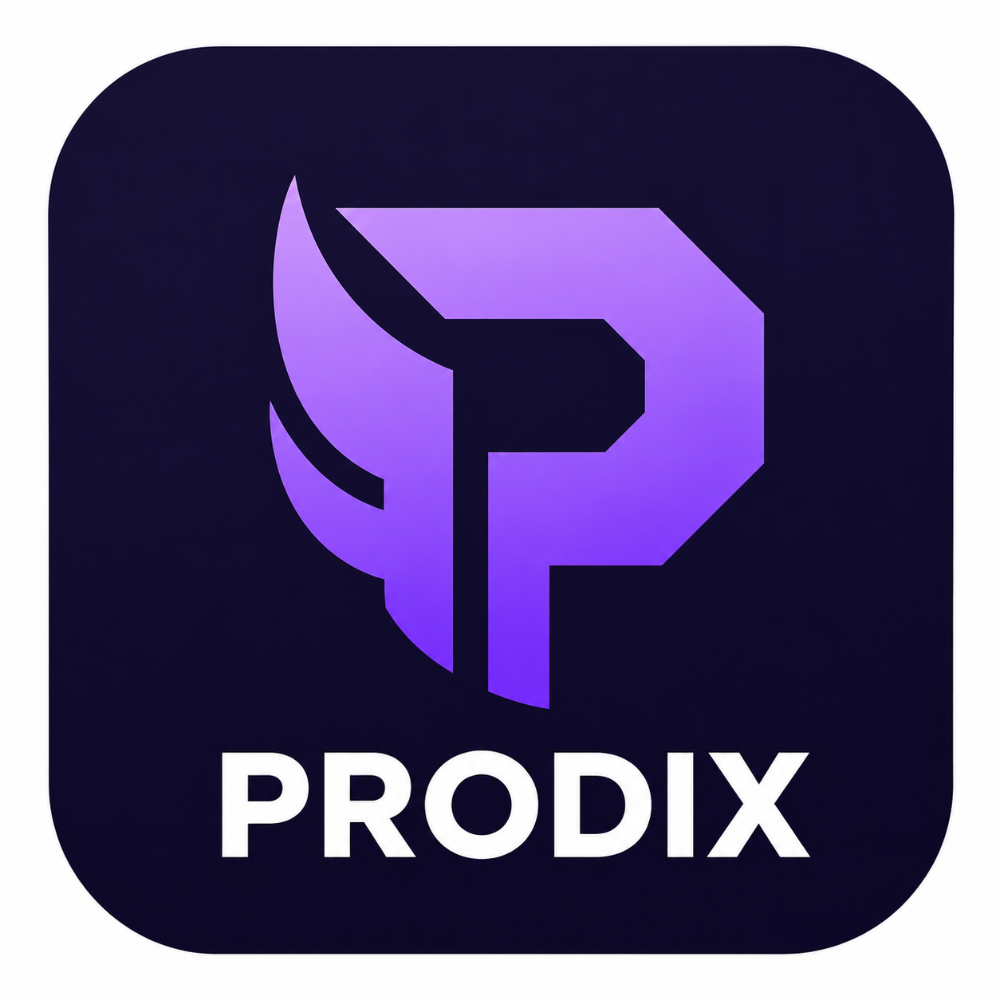

<p align="center">
  
</p>

<h1 align="center">Prodix</h1>

<p align="center">
  <a href="https://github.com/StailiSaad/PRODIX/releases"></a>
  <a href="https://github.com/StailiSaad/PRODIX/blob/main/LICENSE"></a>
  <a href="https://flutter.dev"></a>
  <a href="https://supabase.com"></a>
</p>

<p align="center">
  A mobile gaming companion that combines <strong>social matchmaking</strong>, <strong>real-time communication</strong>, <strong>AI-powered moderation</strong>, and an <strong>Android performance enhancer</strong>.
</p>

---

## Table of Contents

- [Features](#features)
- [Architecture](#architecture)
- [Installation](#installation)
- [Building from Source](#building-from-source)
- [Tech Stack](#tech-stack)
- [License](#license)

---

## Features

### Social Platform

| Feature | Description |
|---------|-------------|
| Matchmaking | Find players by game, region, availability, and skill level |
| Real-time Chat | Direct and group messaging with media sharing |
| Voice / Video Calls | Peer-to-peer and team calls via WebRTC |
| Teams & Squads | Create teams, channels, and squad-based communication |
| Activity Feed | Posts, comments, likes, and social interactions |
| Reputation System | Rate teammates on skill, communication, and conduct |
| Gamification | XP, badges, levels, and quest progression |
| Push Notifications | Firebase Cloud Messaging for calls and messages |

### Performance Enhancer

| Module | Effect |
|--------|--------|
| Frame Pacing | Smoothens display refresh and SurfaceFlinger phase offsets |
| GoodPing | Optimises DNS, TCP buffers, and connectivity for lower latency |
| PerfExt | Enhances GPU rendering, power mode, and animation speed |
| Runtime Control | Disables doze, app standby, and thermal throttling |
| GamePulse | Provides game mode overlay and GPU driver optimisation |
| GPU Boost | Improves Skia / Vulkan rendering and hardware composition |
| Audio Tuning | Optimises low-latency audio flinger |
| Hyper Performance | Comprehensive CPU / GPU / memory / I/O tuning |

### AI Integration

- **Toxicity Detection**: automatic moderation of chat messages via Hugging Face.
- **Teammate Recommendations**: AI-powered player suggestions.

---

## Architecture

```
Prodix
├── Flutter (Dart)
│   ├── lib/main.dart                # Entry point
│   ├── lib/app_root.dart            # Bootstrap and Bloc providers
│   ├── lib/core/
│   │   ├── config/                  # AppConfig (Supabase, AI, environment)
│   │   ├── services/                # Notifications, push, background, calls
│   │   └── theme/                   # Futuristic light and dark themes
│   ├── lib/data/
│   │   └── services/                # Supabase backend and domain services
│   ├── lib/features/
│   │   ├── auth/                    # Authentication flow
│   │   ├── profile/                 # User profile management
│   │   ├── dashboard/               # Main screen, home, DM chat
│   │   ├── call/                    # P2P and team calls (WebRTC)
│   │   ├── gamification/            # XP, badges, levels
│   │   ├── theme/                   # Light / dark / system theme
│   │   └── posts/                   # Social feed, comments, likes
│   └── lib/shared/widgets/          # Reusable UI components
│
├── Android Native (Kotlin)
│   ├── app/                         # Flutter host and method channels
│   └── androidenhancer/             # Performance optimisation modules
│
├── Supabase
│   ├── supabase_setup.sql           # Full schema and RLS policies
│   └── supabase_migrations/         # Incremental migrations
│
└── Assets
    ├── assets/data/games_db.json    # Game catalogue
    └── assets/data/countries.json   # Country list
```

### Data Flow

```
User Action → Flutter UI → Bloc / Cubit → SupabaseBackendService
                                              ├── Supabase (auth, database, realtime, storage)
                                              └── AiGatewayService → Hugging Face API

Performance Toggle → MethodChannel → Android Enhancer
                                          ├── Shell scripts (root / ADB)
                                          └── Native JNI → libandroidenhancer.so
```

---

## Installation

Download the latest APK from the [GitHub Releases](https://github.com/StailiSaad/PRODIX/releases) page.

| File | Size | Requirements |
|------|------|--------------|
| `prodix-v1.0.0.apk` | ~102 MB | Android 7.0+ (API 24), 2 GB RAM minimum |

```bash
# Install via ADB
adb install prodix-v1.0.0.apk

# Grant performance enhancer permissions (non-root devices)
adb shell pm grant com.example.prodix android.permission.WRITE_SECURE_SETTINGS
```

Rooted users do not need the ADB command — the app auto-detects root access and uses LibSu for shell execution.

---

## Building from Source

```bash
# Install dependencies
flutter pub get

# Build release APK
flutter build apk --release

# Output: build/app/outputs/flutter-apk/app-release.apk
```

---

## Tech Stack

| Layer | Technology |
|-------|------------|
| Framework | Flutter 3.41 / Dart 3.11 |
| State Management | flutter_bloc 8.1, equatable |
| Backend | Supabase (PostgreSQL, Auth, Realtime, Storage) |
| Artificial Intelligence | Hugging Face Inference API |
| Push Notifications | Firebase Cloud Messaging |
| Real-time Communication | flutter_webrtc, WebRTC |
| Dependency Injection (Android) | Dagger Hilt 2.57 |
| Root Shell | LibSu 6.0, HiddenApiBypass |
| Background Tasks | Workmanager, AlarmManager |
| Local Storage | SharedPreferences, DataStore |

---

## License

Proprietary. All rights reserved.

---

<p align="center">
  <a href="https://github.com/StailiSaad">StailiSaad</a> &nbsp;|&nbsp;
  <a href="https://github.com/StailiSaad/PRODIX">GitHub</a>
</p>
