<p align="center">
  
</p>

<h1 align="center">🚀 PRODIX</h1>

<p align="center">
  <b>Game Together. Boost Performance. Stay Connected.</b>
</p>

<p align="center">
  <a href="#-features">Features</a> •
  <a href="#-screenshots">Screenshots</a> •
  <a href="#-installation">Installation</a> •
  <a href="#-adb-setup">ADB Setup</a> •
  <a href="#-architecture">Architecture</a>
</p>

<hr/>

## 📱 Overview

**Prodix** is an all-in-one mobile application for gamers — combining **social matchmaking**, **real-time chat & calls**, **AI-powered moderation**, and a powerful **Android performance enhancer** that optimizes your device for gaming.

> Built with Flutter • Supabase • Hugging Face AI • Android Native (Hilt / LibSu)

---

## ✨ Features

### 🎮 Social Gaming Platform
| Feature | Description |
|---------|-------------|
| **Matchmaking** | Find players by game, region, availability & skill level |
| **Real-time Chat** | Direct & group messaging with media sharing |
| **Voice/Video Calls** | P2P & team calls powered by WebRTC |
| **Teams & Squads** | Create teams, channels, and squad-based communication |
| **Activity Feed** | Posts, comments, likes, and social interactions |
| **Reputation System** | Rate teammates on skill, communication & conduct |
| **Push Notifications** | Firebase Cloud Messaging for calls & messages |

### ⚡ Android Performance Enhancer
| Module | Effect | Root Required |
|--------|--------|:---:|
| **Frame Pacing** | Smooths display refresh & SurfaceFlinger phase offsets | ❌ No (ADB) |
| **GoodPing** | DNS, TCP buffers & connectivity tuning for lower latency | ❌ No (ADB) |
| **PerfExt** | GPU rendering, power mode & animation speed optimization | ❌ No (ADB) |
| **Runtime Control** | Disables doze, app standby, thermal throttling | ❌ No (ADB) |
| **GamePulse** | Game mode overlay & GPU driver optimization | ❌ No (ADB) |
| **GPU Boost** | Skia/Vulkan rendering & hardware composition | ❌ No (ADB) |
| **Audio Tuning** | Low-latency audio flinger optimization | ❌ No (ADB) |
| **Hyper Performance** | Comprehensive CPU/GPU/memory/I/O tuning | ❌ No (ADB) |

### 🤖 AI Integration (Hugging Face)
- **Toxicity Detection** — automatic moderation of chat messages
- **Teammate Recommendations** — AI-powered player suggestions

---

## 📸 Screenshots

> *Insert your screenshots here — recommended: PNG, 1080×2340*

| | | |
|:---:|:---:|:---:|
| **Splash / Auth** | **Dashboard** | **Matchmaking** |
|  |  |  |
| **Chat** | **Calls** | **Profile** |
|  |  |  |
| **Performance Enhancer** | **Modules** | **Notifications** |
|  |  |  |

---

## ⬇️ Installation

### Download APK

Grab the latest release from [GitHub Releases](https://github.com/StailiSaad/PRODIX/releases):

```
📦 app-release.apk (101.7 MB)
```

> **Requirements:** Android 7.0+ (API 24), 2 GB RAM minimum

### Install on Device

```bash
# 1. Enable Developer Options & USB Debugging on your phone
# 2. Connect via USB
# 3. Install the APK
adb install app-release.apk
```

---

## 🛠 ADB Setup

To use the **Performance Enhancer** modules on a **non-rooted** device, grant the `WRITE_SECURE_SETTINGS` permission:

```bash
adb shell pm grant com.example.prodix android.permission.WRITE_SECURE_SETTINGS
```

After running the command, press **"J'ai appliqué la commande"** inside the app.

> **Rooted users:** The app auto-detects root and uses LibSu for shell execution.

---

## 🏗 Architecture

```
Prodix
├── Flutter (Dart)
│   ├── lib/
│   │   ├── main.dart              # Entry point
│   │   ├── app_root.dart          # Bootstrap & Bloc providers
│   │   ├── core/
│   │   │   ├── config/            # AppConfig (Supabase, AI, env vars)
│   │   │   ├── services/          # Notifications, Push, Background, Calls
│   │   │   └── theme/             # Futuristic light/dark themes
│   │   ├── data/
│   │   │   └── services/          # SupabaseBackendService + domain services
│   │   ├── features/
│   │   │   ├── auth/              # AuthCubit, Login, Register, Splash
│   │   │   ├── profile/           # ProfileCubit, Setup, Edit
│   │   │   ├── dashboard/         # MainScreen, Home, DM Chat, Feed
│   │   │   ├── call/              # P2P & Team Calls (WebRTC)
│   │   │   ├── gamification/      # XP, Badges, Levels
│   │   │   ├── theme/             # ThemeCubit (Light/Dark/System)
│   │   │   └── posts/             # Social feed, comments, likes
│   │   └── shared/widgets/        # Reusable UI components
│   └── pubspec.yaml
│
├── Android Native (Kotlin)
│   ├── app/
│   │   ├── ProdixApplication.kt   # @HiltAndroidApp, Shell init
│   │   ├── MainActivity.kt        # FlutterActivity + MethodChannels
│   │   ├── BackgroundService.kt    # Foreground polling (30s)
│   │   ├── CallForegroundService.kt
│   │   ├── CallMessagingService.kt # FCM handler
│   │   ├── OverlayService.kt      # Floating overlay during calls
│   │   └── DeclineService.kt
│   └── androidenhancer/
│       ├── MainActivity.kt        # @AndroidEntryPoint (Compose UI)
│       ├── AppRepository.kt       # @Singleton — DataStore, RootIpc
│       ├── OptimizationExecutor.kt # Shell script runner (8 modules)
│       ├── RootService.kt         # AIDL IPC for root commands
│       └── BootService.kt         # Auto-start on boot
│
├── Supabase
│   ├── supabase_setup.sql         # Full schema + RLS policies
│   └── supabase_migrations/       # Incremental migrations
│
└── Assets
    ├── assets/data/games_db.json  # Game catalog
    └── assets/data/countries.json # Country list
```

### Data Flow

```
User Action → Flutter UI → Bloc/Cubit → SupabaseBackendService
                                              ├── Supabase Client (Auth, DB, Realtime, Storage)
                                              └── AiGatewayService → Hugging Face API

Performance Toggle → MethodChannel → Android Enhancer
                                          ├── Shell scripts (root/ADB)
                                          └── Native JNI → libandroidenhancer.so
```

---

## 🧰 Tech Stack

| Layer | Technology |
|-------|-----------|
| **Framework** | Flutter 3.41 • Dart 3.11 |
| **State Management** | flutter_bloc 8.1 • equatable |
| **Backend** | Supabase (PostgreSQL, Auth, Realtime, Storage) |
| **AI** | Hugging Face Inference API |
| **Push** | Firebase Cloud Messaging |
| **Calls** | flutter_webrtc • WebRTC |
| **DI (Android)** | Dagger Hilt 2.57 |
| **Root Shell** | LibSu 6.0 • HiddenApiBypass |
| **Background** | Workmanager • AlarmManager |
| **Local Storage** | SharedPreferences • DataStore |

### Android Tweaker: Root vs Non-Root

| Capability | Non-Root (ADB) | Root (LibSu) |
|------------|:---:|:---:|
| All 8 optimization modules | ✅ (via `adb shell pm grant`) | ✅ |
| Auto-execute on boot | ❌ | ✅ |
| Kernel-level tuning (governor, scheduler) | ❌ | ✅ |
| Thermal engine override | ❌ | ✅ |
| Full GPU clock control | ❌ | ✅ |
| Persistent tweaks across reboots | ❌ | ✅ |

> **Non-root:** Grant `WRITE_SECURE_SETTINGS` via ADB (see §ADB Setup). Modules run via `settings put global` / `device_config`.
> **Root:** LibSu executes shell commands directly with superuser access — no ADB needed.

---

## 🗄 Database Schema (PlantUML)

```plantuml
@startuml
!theme plain
skinparam backgroundColor #1a1a2e
skinparam component {
  BackgroundColor #16213e
  BorderColor #0f3460
  FontColor #e94560
}
skinparam actor {
  BorderColor #0f3460
  BackgroundColor #16213e
  FontColor #e94560
}
skinparam package {
  BackgroundColor #1a1a2e
  BorderColor #0f3460
  FontColor #e94560
}

title "PRODIX Database Schema"

' --- Users & Auth ---
entity "auth.users" as auth_users {
  *id: uuid <<PK>>
  --
  email: text
  password_hash: text
  created_at: timestamptz
}

entity "public.users" as public_users {
  *id: uuid <<PK>>
  --
  email: text <<UNIQUE>>
  password_hash: text
  created_at: timestamptz
}

entity "public.profiles" as profiles {
  *id: uuid <<PK, FK→auth.users>>
  --
  pseudo: text <<UNIQUE>>
  avatar_url: text
  level: text
  language: text
  availability: text
  reputation_score: int
  bio: text
  birth_date: text
  phone: text
  location: text
  social_instagram: text
  social_facebook: text
  social_github: text
  game_type: text
  rank_mmr: int
  role: text
  region: text
  win_ratio: float
  experience_points: int
  matches_played: int
  show_email: bool
  show_phone: bool
  show_location: bool
  country: text
  created_at: timestamptz
  updated_at: timestamptz
}

' --- Social ---
entity "public.friends" as friends {
  *user_id: uuid <<FK→profiles>>
  *friend_id: uuid <<FK→profiles>>
  --
  created_at: timestamptz
}

entity "public.posts" as posts {
  *id: uuid <<PK>>
  --
  user_id: uuid <<FK→auth.users>>
  caption: text
  media_urls: text[]
  media_types: text[]
  visibility: text
  created_at: timestamptz
  updated_at: timestamptz
}

entity "public.post_comments" as post_comments {
  *id: uuid <<PK>>
  --
  post_id: uuid <<FK→posts>>
  user_id: uuid <<FK→auth.users>>
  parent_id: uuid <<FK→post_comments>>
  content: text
  created_at: timestamptz
}

entity "public.post_likes" as post_likes {
  *post_id: uuid <<FK→posts>>
  *user_id: uuid <<FK→auth.users>>
  --
  created_at: timestamptz
}

entity "public.post_comment_likes" as post_comment_likes {
  *comment_id: uuid <<FK→post_comments>>
  *user_id: uuid <<FK→auth.users>>
  --
  created_at: timestamptz
}

' --- Teams & Squads ---
entity "public.games" as games {
  *id: uuid <<PK>>
  --
  name: text <<UNIQUE>>
  genre: text
  platform: text
  created_at: timestamptz
}

entity "public.user_games" as user_games {
  *user_id: uuid <<FK→profiles>>
  *game_id: uuid <<FK→games>>
  --
  skill_level: text
  created_at: timestamptz
}

entity "public.profile_favorite_games" as profile_fav_games {
  *profile_id: uuid <<FK→profiles>>
  *game: text
}

entity "public.squads" as squads {
  *id: uuid <<PK>>
  --
  name: text
  logo_url: text
  owner_id: uuid <<FK→auth.users>>
  created_at: timestamptz
}

entity "public.squad_members" as squad_members {
  *squad_id: uuid <<FK→squads>>
  *user_id: uuid <<FK→auth.users>>
  --
  role: text
  joined_at: timestamptz
}

entity "public.channels" as channels {
  *id: uuid <<PK>>
  --
  squad_id: uuid <<FK→squads>>
  name: text
  type: text
}

entity "public.teams" as teams {
  *id: uuid <<PK>>
  --
  owner_id: uuid <<FK→profiles>>
  name: text
  game_id: uuid <<FK→games>>
  status: text
  squad_id: uuid <<FK→squads>>
  avatar_url: text
  created_at: timestamptz
}

entity "public.team_members" as team_members {
  *team_id: uuid <<FK→teams>>
  *user_id: uuid <<FK→profiles>>
  --
  role: text
  joined_at: timestamptz
  status: text
}

' --- Messaging & Calls ---
entity "public.messages" as messages {
  *id: uuid <<PK>>
  --
  sender_id: uuid <<FK→profiles>>
  receiver_id: uuid <<FK→profiles>>
  channel_id: uuid <<FK→channels>>
  content: text
  status: text
  media_url: text
  media_type: text
  media_name: text
  duration: int
  created_at: timestamptz
}

entity "public.calls" as calls {
  *id: uuid <<PK>>
  --
  caller_id: uuid <<FK→auth.users>>
  callee_id: uuid <<FK→auth.users>>
  status: text
  call_type: text
  offer_sdp: text
  answer_sdp: text
  started_at: timestamptz
  ended_at: timestamptz
  created_at: timestamptz
}

entity "public.call_ice_candidates" as call_ice {
  *id: uuid <<PK>>
  --
  call_id: uuid <<FK→calls>>
  sender_id: uuid <<FK→profiles>>
  candidate: text
  sdp_mid: text
  sdp_mline_index: int
  created_at: timestamptz
}

entity "public.squad_calls" as squad_calls {
  *id: uuid <<PK>>
  --
  squad_id: uuid <<FK→squads>>
  caller_id: uuid <<FK→profiles>>
  call_type: text
  status: text
  created_at: timestamptz
  ended_at: timestamptz
}

entity "public.squad_call_participants" as squad_call_parts {
  *id: uuid <<PK>>
  --
  call_id: uuid <<FK→squad_calls>>
  user_id: uuid <<FK→profiles>>
  status: text
  offer_sdp: text
  answer_sdp: text
  joined_at: timestamptz
  left_at: timestamptz
}

entity "public.squad_call_ice_candidates" as squad_call_ice {
  *id: uuid <<PK>>
  --
  participant_id: uuid <<FK→squad_call_parts>>
  sender_id: uuid <<FK→profiles>>
  candidate: text
  sdp_mid: text
  sdp_mline_index: int
  created_at: timestamptz
}

entity "public.team_calls" as team_calls {
  *id: uuid <<PK>>
  --
  team_id: uuid <<FK→teams>>
  caller_id: uuid <<FK→profiles>>
  call_type: text
  status: text
  created_at: timestamptz
  ended_at: timestamptz
}

entity "public.team_call_participants" as team_call_parts {
  *id: uuid <<PK>>
  --
  call_id: uuid <<FK→team_calls>>
  user_id: uuid <<FK→profiles>>
  status: text
  offer_sdp: text
  answer_sdp: text
  joined_at: timestamptz
  left_at: timestamptz
}

entity "public.team_call_ice_candidates" as team_call_ice {
  *id: uuid <<PK>>
  --
  participant_id: uuid <<FK→team_call_parts>>
  sender_id: uuid <<FK→profiles>>
  candidate: text
  sdp_mid: text
  sdp_mline_index: int
  created_at: timestamptz
}

' --- Notifications & Invitations ---
entity "public.notifications" as notifications {
  *id: uuid <<PK>>
  --
  user_id: uuid <<FK→profiles>>
  type: text
  payload: jsonb
  is_read: bool
  created_at: timestamptz
}

entity "public.invitations" as invitations {
  *id: uuid <<PK>>
  --
  sender_id: uuid <<FK→profiles>>
  receiver_id: uuid <<FK→profiles>>
  status: text
  team_id: uuid <<FK→teams>>
  created_at: timestamptz
  updated_at: timestamptz
  expires_at: timestamptz
}

entity "public.squad_invitations" as squad_invitations {
  *id: uuid <<PK>>
  --
  squad_id: uuid <<FK→squads>>
  sender_id: uuid <<FK→auth.users>>
  receiver_id: uuid <<FK→auth.users>>
  status: text
  created_at: timestamptz
}

entity "public.sessions" as sessions {
  *id: uuid <<PK>>
  --
  invitation_id: uuid <<FK→invitations>>
  status: text
  created_at: timestamptz
}

' --- Gamification & Reputation ---
entity "public.reputation_reviews" as rep_reviews {
  *id: bigint <<PK>>
  --
  reviewer_id: uuid <<FK→profiles>>
  reviewed_id: uuid <<FK→profiles>>
  skill_score: int
  communication_score: int
  toxicity_score: int
  comment: text
  created_at: timestamptz
}

entity "public.reviews" as reviews {
  *id: uuid <<PK>>
  --
  reviewer_id: uuid <<FK→profiles>>
  reviewed_id: uuid <<FK→profiles>>
  score: int
  toxicity_flag: bool
  comment: text
  review_day: date
  created_at: timestamptz
}

entity "public.match_events" as match_events {
  *id: uuid <<PK>>
  --
  user_id: uuid <<FK→profiles>>
  matched_user_id: uuid <<FK→profiles>>
  compatibility_score: numeric
  source: text
  created_at: timestamptz
}

entity "public.user_progress" as user_progress {
  *user_id: uuid <<PK, FK→auth.users>>
  --
  data: jsonb
  created_at: timestamptz
  updated_at: timestamptz
}

' --- Devices & Subscriptions ---
entity "public.devices" as devices {
  *id: uuid <<PK>>
  --
  user_id: uuid <<FK→auth.users>>
  token: text
  platform: text
  created_at: timestamptz
  updated_at: timestamptz
}

entity "public.subscriptions" as subscriptions {
  *id: uuid <<PK>>
  --
  user_id: uuid <<FK→profiles>>
  plan: text
  status: text
  started_at: timestamptz
  expires_at: timestamptz
}

' --- Legacy (tasksync) ---
entity "public.tasksync_users" as ts_users {
  *id: bigint <<PK>>
  --
  email: text <<UNIQUE>>
  full_name: text
  password_hash: text
  role: text
}

entity "public.tasksync_projects" as ts_projects {
  *id: bigint <<PK>>
  --
  name: text
  description: text
  owner_id: bigint <<FK→ts_users>>
  created_at: timestamp
}

entity "public.tasksync_tasks" as ts_tasks {
  *id: bigint <<PK>>
  --
  title: text
  description: text
  status: text
  due_date: timestamp
  assignee_id: bigint <<FK→ts_users>>
  project_id: bigint <<FK→ts_projects>>
  created_at: timestamp
}

entity "public.projects" as projects {
  *id: bigint <<PK>>
  --
  name: text
  description: text
  owner_id: bigint
  created_at: timestamp
}

entity "public.tasks" as tasks {
  *id: bigint <<PK>>
  --
  title: text
  description: text
  status: text
  due_date: timestamp
  assignee_id: bigint
  project_id: bigint <<FK→projects>>
  created_at: timestamp
}

' --- Relationships ---
auth_users ||--o| profiles : "1:1"
auth_users ||--o{ devices : "1:N"
auth_users ||--o{ user_progress : "1:1"
auth_users ||--o{ squad_members : "1:N"
auth_users ||--o{ squad_invitations : "sender"
auth_users ||--o{ squad_invitations : "receiver"
auth_users ||--o{ calls : "caller"
auth_users ||--o{ calls : "callee"
auth_users ||--o{ posts : "author"
auth_users ||--o{ post_comments : "author"
auth_users ||--o{ post_likes : "liker"
auth_users ||--o{ post_comment_likes : "liker"

profiles ||--o{ friends : "user"
profiles ||--o{ friends : "friend"
profiles ||--o{ notifications : "1:N"
profiles ||--o{ messages : "sender"
profiles ||--o{ messages : "receiver"
profiles ||--o{ reviews : "reviewer"
profiles ||--o{ reviews : "reviewed"
profiles ||--o{ rep_reviews : "reviewer"
profiles ||--o{ rep_reviews : "reviewed"
profiles ||--o{ match_events : "user"
profiles ||--o{ match_events : "matched"
profiles ||--o{ invitations : "sender"
profiles ||--o{ invitations : "receiver"
profiles ||--o{ subscriptions : "1:N"
profiles ||--o{ teams : "owner"
profiles ||--o{ team_members : "member"
profiles ||--o{ user_games : "1:N"
profiles ||--o{ profile_fav_games : "1:N"
profiles ||--o{ call_ice : "sender"
profiles ||--o{ squad_calls : "caller"
profiles ||--o{ squad_call_parts : "participant"
profiles ||--o{ squad_call_ice : "sender"
profiles ||--o{ team_calls : "caller"
profiles ||--o{ team_call_parts : "participant"
profiles ||--o{ team_call_ice : "sender"

squads ||--o{ squad_members : "1:N"
squads ||--o{ channels : "1:N"
squads ||--o{ squad_calls : "1:N"
squads ||--o{ squad_invitations : "1:N"
squads ||--o{ teams : "1:N"

games ||--o{ teams : "1:N"
games ||--o{ user_games : "1:N"

teams ||--o{ team_members : "1:N"
teams ||--o{ team_calls : "1:N"
teams ||--o{ invitations : "1:N"

posts ||--o{ post_comments : "1:N"
posts ||--o{ post_likes : "1:N"
post_comments ||--o{ post_comment_likes : "1:N"
post_comments ||--o{ post_comments : "parent"

calls ||--o{ call_ice : "1:N"
squad_calls ||--o{ squad_call_parts : "1:N"
squad_call_parts ||--o{ squad_call_ice : "1:N"
team_calls ||--o{ team_call_parts : "1:N"
team_call_parts ||--o{ team_call_ice : "1:N"

channels ||--o{ messages : "1:N"
invitations ||--o{ sessions : "1:N"

@enduml
```



This diagram was generated from the production Supabase schema. To render it, use [PlantText](https://www.planttext.com/), [PlantUML Server](https://plantuml.com/), or any PlantUML renderer.

> **Note:** This schema is for context only and is not meant to be run. It reflects the pre-production state.

---

## 📄 License

```
© 2026 Prodix. All rights reserved.
```

---

<p align="center">
  Made with ❤️ by <a href="https://github.com/StailiSaad">StailiSaad</a>
  <br/>
</p>
